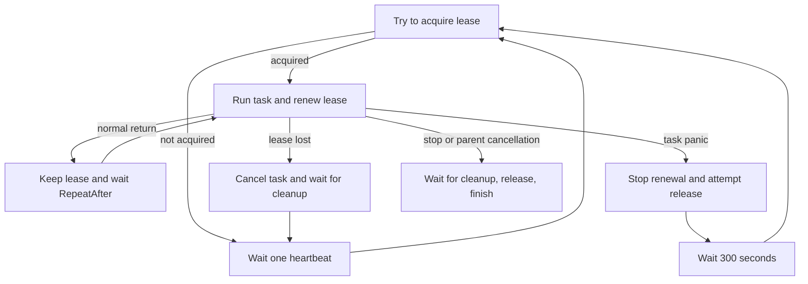

# EasyRoutine

EasyRoutine runs local work with panic recovery and coordinates one active task
across multiple processes.

| API | Use it for |
| --- | --- |
| `SafeGo` | Local background work with policy-controlled panic retries |
| `StartUniqueSupervisor` | A persistent task that must have one active owner across processes |

## Part 1: Usage

### Install

```sh
go get github.com/LazyEasyDev/EasyRoutine
```

The examples use this import:

```go
import EasyRoutine "github.com/LazyEasyDev/EasyRoutine"
```

All task contexts and callbacks are required. Invalid startup arguments return
an error before a goroutine is started. Tasks should observe `ctx.Done()` and
pass the supplied context to network and database calls so cancellation can
finish. In the snippets below, `appCtx` is the application's context.

### Run Local Work with SafeGo

`SafeGo` starts a goroutine and recovers task panics. Its policy receives the
recovered value, stack trace, and a one-based failure count.

```go
handle, err := EasyRoutine.SafeGo(appCtx, func(ctx context.Context) {
	process(ctx)
}, func(recovered EasyRoutine.Panic, failures int) EasyRoutine.PanicDecision {
	log.Printf("attempt %d panicked: %v\n%s", failures, recovered.Value, recovered.Stack)

	if failures >= 3 {
		return EasyRoutine.NoRetry()
	}
	return EasyRoutine.PanicDecision{
		Retry: true,
		After: 30 * time.Second,
	}
})
if err != nil {
	log.Fatal(err)
}
```

Return values from the policy:

| Decision | Result |
| --- | --- |
| `PanicDecision{Retry: true, After: delay}` | Run the task again after `delay` |
| `PanicDecision{Retry: true}` | Retry immediately |
| `NoRetry()` or `PanicDecision{}` | Stop after recovering the panic |

A panic from the policy safely stops the task. The context, task, and policy are
required; invalid startup arguments are returned as errors before a goroutine is
started. `NoRetry()` returns a new stop decision. `SafeGo` also stops when the
task returns normally, the parent context is canceled, or `Stop()` is called.

Each retry receives a fresh child context. The failed attempt's context is
canceled before the policy runs.

### Run One Task Across Many Processes

A unique supervisor needs one lease backend configured during process startup.
The included SQL backend is the usual setup.

#### Configure a SQL Backend

The application owns and imports its `database/sql` driver. EasyRoutine adds no
ORM or wire-driver dependency. This PostgreSQL example uses
`github.com/jackc/pgx/v5/stdlib`:

```go
import (
	"database/sql"

	_ "github.com/jackc/pgx/v5/stdlib"
)

db, err := sql.Open("pgx", databaseURL)
if err != nil {
	log.Fatal(err)
}

if err := EasyRoutine.InitSQLLease(appCtx, db, EasyRoutine.SQLPostgreSQL); err != nil {
	log.Fatal(err)
}
```

`InitSQLLease` creates the `unique_routine` current-state table and the
`unique_routine_log` history table when needed, adds the history routine-ID
index, and registers the backend. It is safe for each application process to
call during startup, but the database user must have permission to create them.

`EnsureSchema` creates missing objects; it does not alter existing columns.
Installations created with an older schema must migrate or recreate
`unique_routine` and `unique_routine_log` before upgrading because it does not
add the new `routine_id` columns or replace older indexes automatically.

Select the database family explicitly:

| Database | Dialect constant |
| --- | --- |
| PostgreSQL | `SQLPostgreSQL` |
| MySQL | `SQLMySQL` |
| MariaDB | `SQLMariaDB` |
| TiDB | `SQLTiDB` |
| SQLite | `SQLSQLite` |
| SQL Server | `SQLServer` |
| GaussDB | `SQLGaussDB` |
| Oracle | `SQLOracle` |

SQLite is appropriate only when every process can safely access the same
database file. Use a server database for coordination across hosts.

#### Start the Supervisor

Every process may start a supervisor with the same name. Only the lease owner
runs the task. Use the same stable name in every process.

A task name must:

- contain 1 to 255 bytes of valid UTF-8;
- have no leading or trailing whitespace; and
- contain no control characters anywhere.

**Important:** Control characters are forbidden even when they appear in the
middle of a name. This includes newlines (`\n`), carriage returns (`\r`), tabs
(`\t`), null bytes (`\x00`), escape characters (`\x1b`), and delete (`\x7f`).
For example, `daily report` is valid, but `daily\nreport`, `daily\treport`, and
`daily\x00report` are invalid. Ordinary internal spaces, Unicode text,
punctuation, quotes, and symbols are allowed.

```go
supervisor, err := EasyRoutine.StartUniqueSupervisor(
	appCtx,
	"queue-consumer",
	func(ctx context.Context) {
		consumeQueue(ctx)
	},
	func(recovered EasyRoutine.Panic) {
		log.Printf("unique task panicked: %v\n%s", recovered.Value, recovered.Stack)
	},
	10 * time.Second,
)
if err != nil {
	log.Fatal(err)
}
```

After the task function returns normally, the supervisor retains the lease and
starts it again after the repeat delay. A zero duration repeats immediately; a
negative duration is rejected. Lease heartbeats continue during the wait.

The panic callback is required and notification-only. Supervisor recovery
timing is fixed and cannot be changed by the callback.

#### Read Current Status and History

Read the single current status row for every task or selected tasks:

```go
allStatuses, err := EasyRoutine.GetStatuses(appCtx)
selectedStatuses, err := EasyRoutine.GetStatuses(appCtx, "queue-consumer", "billing")
```

Statuses are ordered by name. `ExpiresAt` determines whether the stored owner
still has a live lease; a clean release keeps the row and expires its lease
immediately. The row can also describe the last observed state of a process
whose lease expired.

Read retained logs for every task, selected tasks, or an existing slice:

```go
allLogs, err := EasyRoutine.GetLogs(appCtx)
selectedLogs, err := EasyRoutine.GetLogs(appCtx, "queue-consumer", "billing")
sliceLogs, err := EasyRoutine.GetLogs(appCtx, names...)
```

Results are newest first. Each history record contains the action, task status,
owner token, message, and a database-generated timestamp. Panic records include
the recovered value and stack in `Log`; other records have an empty message.
Current statuses contain `SuccessCount` and `FailureCount`. Those counters
belong to one supervisor instance and reset when a new instance starts.

Current state is persisted, and history events are sampled, by lease actions
rather than on every task transition:

| Action | Snapshot |
| --- | --- |
| `LeaseAcquire` | `RoutineNotStarted` before the first attempt for that owner |
| `LeaseRenew` | Latest `RoutineRunning` or `RoutineDone` state and counters |
| `LeaseRelease` | Final `RoutineDone` or `RoutinePanic` state and counters |

The SQL backend retains the newest 25 history records for each task name. Log
insertion and pruning are best effort and never change a successful lease
operation into a failure. Release is idempotent, so its history snapshot is
also recorded when that owner no longer has a matching live lease.

#### Use a Custom Backend

Register a custom `LeaseProvider` instead of the SQL backend:

```go
if err := EasyRoutine.InitLease(myLeaseProvider); err != nil {
	log.Fatal(err)
}
```

Call `InitLease` or `InitSQLLease` exactly once per process and before starting
any unique supervisor. `SafeGo` does not require lease initialization.

#### Manage SQL Schema Separately

When migrations or a privileged startup step owns DDL, construct the backend
without automatically creating the tables:

```go
backend, err := EasyRoutine.NewSQLLease(db, EasyRoutine.SQLPostgreSQL)
if err != nil {
	log.Fatal(err)
}

if err := EasyRoutine.InitLease(backend); err != nil {
	log.Fatal(err)
}
```

Run `backend.EnsureSchema(ctx)` from the schema-management step when desired.

### Stop and Observe Work

Both `Handle` and `UniqueSupervisor` expose the same lifecycle methods:

```go
worker.Stop()      // request cooperative cancellation
<-worker.Done()   // wait using a channel
worker.Wait()     // or block directly
```

`Done()` only returns a completion channel; calling it does not stop work.
Stopping is cooperative, so completion waits for the task to return.

For a unique supervisor, the heartbeat continues while the canceled task
performs cleanup. After cleanup, the supervisor stops renewal and makes one
bounded release attempt. If that release fails, shutdown still completes and
the lease remains unavailable until its database expiration time.

---

## Part 2: Design and Internals

### Local Panic Recovery

`SafeGo` executes one task attempt at a time:

1. Create a child context for the attempt.
2. Run the task and recover any panic with its stack trace.
3. Cancel the failed attempt's context.
4. Call `PanicPolicy` with the one-based failure count.
5. Stop or wait for the requested delay and retry with a fresh context.

EasyRoutine cannot track or wait for goroutines created inside a task. Those
goroutines must observe the task context themselves.

### Unique Supervisor State Flow



On panic, the first release attempt happens before `SupervisorPanicHandler` is
called. Failed releases are attempted again on the heartbeat cadence during the
300-second cooldown. If release succeeds, this process remains idle for the
rest of the cooldown while another process may acquire the lease immediately.

### Fixed Timing

| Setting | Value | Purpose |
| --- | ---: | --- |
| Lease TTL | 180 seconds | Maximum ownership lifetime without a successful renewal |
| Heartbeat | 30 seconds | Acquisition, renewal, and failed-release cadence |
| Release timeout | 30 seconds | Maximum duration of one release call |
| Panic cooldown | 300 seconds | Delay before the panicked process competes for ownership again |

Lease expiration is calculated with the database clock, avoiding dependence on
application-host clock agreement.

### Lease Backend Contract

```go
type LeaseProvider interface {
	Action(ctx context.Context, action LeaseAction, state LeaseState) bool
	GetStatuses(ctx context.Context, names ...string) ([]SupervisorStatus, error)
	GetLogs(ctx context.Context, names ...string) ([]SupervisorLog, error)
}
```

Backend requirements:

- The ownership effect of each `Action` must be atomic.
- `LeaseRenew` may succeed only while the lease belongs to `state.Owner`.
- `LeaseRelease` must end only a lease owned by `state.Owner`. It is idempotent
  and returns `true` when that owner no longer holds the lease, including when
  no matching lease exists.
- `LeaseAcquire` may only claim an absent or expired lease.
- Methods must return promptly when their context is canceled.
- `LeaseAcquire` and `LeaseRenew` return `true` only when their requested
	ownership changes succeed.
- `GetStatuses(ctx)` returns one current row per task ordered by name; supplied
  names filter the result.
- `GetLogs(ctx)` returns all retained records newest first; supplied names
	filter the result.

`LeaseState` carries the task name, owner, TTL, current status, cumulative
counts, and optional log message. Supported statuses are `RoutineNotStarted`,
`RoutineRunning`, `RoutineDone`, and `RoutinePanic`.

Each ownership attempt uses a new cryptographically random owner token. Backend
panics are contained and treated as failed operations.

### SQL Backend

The built-in backend hashes the exact UTF-8 task name with SHA-256 and stores
the lowercase hexadecimal result as an internal `routine_id`. This fixed-size
identifier is the current-state primary key and the history lookup index, so
database collation does not control task identity. The original name remains
stored and returned by query APIs. Names that differ by case or Unicode byte
representation are distinct.

The backend stores ownership and the latest state together in one
`unique_routine` row per routine ID. It stores recent lifecycle history in
`unique_routine_log`, indexed by routine ID. Database-specific statements
update ownership and current state atomically using the database clock. After
every successful action, the backend inserts a best-effort history snapshot
and removes records older than the newest 25 for that routine ID.

ClickHouse is intentionally unsupported. Its normal mutation model does not
provide the transactional, uniqueness-enforcing row operations required by
this lease protocol.

### Distributed Safety

A time-based lease prevents concurrent owners during normal operation, but it
cannot guarantee that stale work has stopped after a long process pause or
network partition. Use idempotent operations or backend-specific fencing tokens
for side effects that require strict ordering.