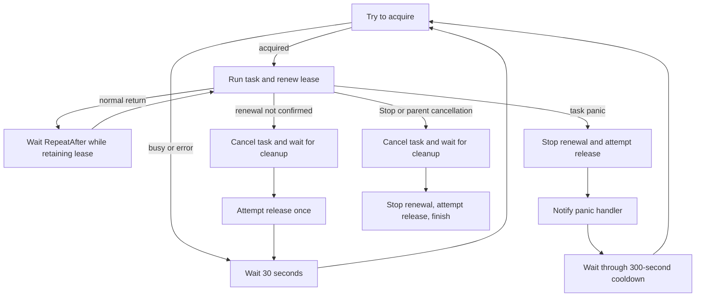

# EasyRoutine

EasyRoutine manages background Go functions. Use `SafeGo` for local panic
recovery. Use `StartUniqueSupervisor` when many processes may start the same
task but only the process holding its SQL lease should run it.

> [!WARNING]
> `StartUniqueSupervisor` is best-effort coordination, not a strict singleton
> or exactly-once guarantee. Long process pauses, network partitions, delayed
> SQL responses, and lease expiration can allow an old task to overlap a new
> owner. Do not rely on the lease alone to protect correctness-critical data.
> Protect database changes with appropriately scoped transactions, row or
> advisory locks, constraints, idempotency keys, or fencing tokens. Work may
> execute more than once; its data mutations must remain correct when it does.

| API | Purpose |
| --- | --- |
| `SafeGo` | Run local work with policy-controlled panic retries |
| `InitSQLLease` | Initialize SQL coordination and create missing schema objects |
| `StartUniqueSupervisor` | Run persistent work while this process owns its lease |
| `GetStatuses` | Read current supervisor state from SQL |
| `GetLogs` | Read retained acquire and release history from SQL |
| `Handle` | Stop, wait for, or observe managed work |

## Install

The module currently targets Go 1.25.13.

```sh
go get github.com/LazyEasyDev/EasyRoutine
```

```go
import EasyRoutine "github.com/LazyEasyDev/EasyRoutine"
```

## Local Work

`SafeGo` starts a goroutine and recovers task panics. The panic policy receives
the recovered value, stack trace, and one-based failure count.

```go
handle, err := EasyRoutine.SafeGo(
	appCtx,
	func(ctx context.Context) {
		process(ctx)
	},
	func(recovered EasyRoutine.Panic, failures int) EasyRoutine.PanicDecision {
		log.Printf("attempt %d panicked: %v\n%s", failures, recovered.Value, recovered.Stack)
		if failures >= 3 {
			return EasyRoutine.NoRetry()
		}
		return EasyRoutine.PanicDecision{
			Retry: true,
			After: 30 * time.Second,
		}
	},
)
if err != nil {
	log.Fatal(err)
}
defer handle.Stop()
```

| Panic decision | Result |
| --- | --- |
| `PanicDecision{Retry: true, After: delay}` | Retry after `delay` |
| `PanicDecision{Retry: true}` | Retry immediately |
| `NoRetry()` or `PanicDecision{}` | Stop after recovery |

The context, task, and panic policy must be non-nil, and the context must still
be active. Invalid arguments return an error before a goroutine starts. A panic
from the policy is contained and stops the task.

Each retry receives a fresh child context. The failed attempt's context is
canceled before the policy runs. A normal return or a stop decision finishes
`SafeGo`. Parent cancellation and `Handle.Stop` stop further retries, but the
handle cannot complete until the current task returns.

## Unique Work Across Processes

Unique supervisors use the built-in SQL lease backend. Initialize it once in
each application process before starting supervisors or querying SQL state.

### Initialize SQL

The application opens and imports its own `database/sql` driver. EasyRoutine
does not include a database driver. This example uses PostgreSQL with pgx:

```go
import (
	"database/sql"

	_ "github.com/jackc/pgx/v5/stdlib"
)

db, err := sql.Open("pgx", databaseURL)
if err != nil {
	log.Fatal(err)
}
defer db.Close()

if err := EasyRoutine.InitSQLLease(appCtx, db, EasyRoutine.SQLPostgreSQL); err != nil {
	log.Fatal(err)
}
```

`InitSQLLease` validates its inputs, creates missing schema objects, and then
registers the SQL backend. If schema setup fails, it returns an error without
registering the backend. Call it exactly once per process. Multiple processes
may initialize against the same shared database during startup.

The database user must be allowed to execute the schema statements. Startup
creates missing objects but does not alter or validate existing tables.

Supported dialects:

| Database | Dialect |
| --- | --- |
| PostgreSQL | `SQLPostgreSQL` |
| MySQL | `SQLMySQL` |
| MariaDB | `SQLMariaDB` |
| TiDB | `SQLTiDB` |
| SQLite | `SQLSQLite` |
| SQL Server | `SQLServer` |
| GaussDB | `SQLGaussDB` |
| Oracle | `SQLOracle` |

SQLite coordinates only processes that can safely access the same database
file. Use a server database when processes run on different hosts.

### Start a Supervisor

Every process may start a supervisor with the same stable name. Under normal
lease operation, only the current owner runs the task.

```go
handle, err := EasyRoutine.StartUniqueSupervisor(
	appCtx,
	"queue-consumer",
	func(ctx context.Context) {
		consumeQueue(ctx)
	},
	func(recovered EasyRoutine.Panic) {
		log.Printf("unique task panicked: %v\n%s", recovered.Value, recovered.Stack)
	},
	10 * time.Second,
)
if err != nil {
	log.Fatal(err)
}
defer handle.Stop()
```

The context, task, and panic handler are required. The repeat delay must not be
negative; zero repeats immediately. Invalid arguments return an error before a
goroutine starts. `InitSQLLease` must succeed before this call.

A supervisor name must:

- contain 1 to 255 bytes of valid UTF-8;
- have no leading or trailing whitespace; and
- contain no control characters.

Names are exact identifiers. Case and UTF-8 byte representation are preserved,
so every process must use the same name for the same task.

After a normal return, the supervisor retains its lease and starts the task
again after the repeat delay. Heartbeats continue during this wait. The panic
handler is notification-only and cannot change recovery timing. It runs after
the first panic release attempt; a panic from the handler is contained.

### Lifecycle



When renewal returns `false`, the supervisor can no longer confirm ownership.
It cancels the task, waits for the task to return, makes one owner-guarded
release attempt, waits one heartbeat, and then competes again with a new owner
token.

On panic, renewal stops before the first release attempt. If release fails, the
supervisor retries it on the heartbeat cadence during the cooldown. This
process does not compete for the lease again until the full cooldown ends.

On `Stop` or parent cancellation, the heartbeat remains active while the task
performs cooperative cleanup. After the task returns, the supervisor stops the
heartbeat and makes one bounded release attempt. The handle completes even if
that release fails. If the task never returns, cleanup cannot finish and the
heartbeat continues while SQL renewal succeeds.

Fixed timings:

| Setting | Value | Purpose |
| --- | ---: | --- |
| Lease TTL | 180 seconds | Ownership lifetime without renewal |
| Heartbeat | 30 seconds | Acquisition, renewal, and panic-release retry cadence |
| Release timeout | 30 seconds | Maximum duration of one release attempt |
| Panic cooldown | 300 seconds | Delay before the panicked process competes again |

SQL renewal retries once after a 10-second, context-aware delay when execution
returns an error. A successful statement affecting zero rows is not retried;
it means ownership was not confirmed.

## Handles and Cancellation

Both launch functions return `*Handle`.

```go
handle.Stop()     // request cooperative cancellation
<-handle.Done()  // wait with a channel
handle.Wait()    // or wait directly
```

`Done` only returns a completion channel; it does not stop work. `Wait` and
`Done` complete after managed work and cleanup finish. Calling `Stop` more than
once is safe. Tasks must observe `ctx.Done()` and pass their supplied context to
blocking operations because EasyRoutine cannot force a function to return.

Task functions, panic policies, and panic handlers must not call
`runtime.Goexit`. It is not a panic, so it does not invoke panic recovery or
retry policy. If a callback nevertheless calls it, managed work stops; a unique
supervisor also stops renewal and attempts release. Return from the callback
instead.

## Status and History

`GetStatuses` and `GetLogs` require successful SQL initialization. With no
names they return all records. Supplied names use the supervisor-name validation
rules. Duplicate filters are removed and large filters are queried in bounded
batches. An all-history `GetLogs` call first discovers stored routine IDs, then
uses the same bounded batches and groups the results by exact routine name.

```go
statuses, err := EasyRoutine.GetStatuses(appCtx)
if err != nil {
	log.Fatal(err)
}
log.Printf("queue status: %+v", statuses["queue-consumer"])

history, err := EasyRoutine.GetLogs(appCtx, "queue-consumer", "billing")
if err != nil {
	log.Fatal(err)
}
log.Printf("queue history: %+v", history["queue-consumer"])

statusJSON, err := statuses.JSON()
if err != nil {
	log.Fatal(err)
}
log.Printf("statuses: %s", statusJSON)
```

`GetStatuses` returns `SupervisorStatuses`, a map from each exact routine name
to its `SupervisorStatus`. `GetLogs` returns `SupervisorHistory`, a map from
each exact routine name to its retained log slice. Missing names are omitted,
and empty results are non-nil empty maps. Each type has a `JSON` method that
encodes the result as a JSON object; a nil value is encoded as `{}`. Map
iteration order is unspecified.

A `SupervisorStatus` is a read-only snapshot of the `unique_routine` row; it
does not control the supervisor lifecycle.
`ExpiresAt`, `UpdatedAt`, and each log's `CreatedAt` are signed Unix seconds
generated by the database clock. The row is retained after release or
expiration, so it may describe a previous owner.

`SuccessCount` and `FailureCount` belong to one in-process supervisor started by
`StartUniqueSupervisor`. They persist if that same supervisor reacquires a
lease and reset when a new supervisor is started.

Current state is sampled during lease operations:

| Operation | Current-state snapshot | History row |
| --- | --- | --- |
| Acquire | `RoutineNotStarted` for the new owner | Yes |
| Renew | Latest sampled status, counters, and log | No |
| Release | Final `RoutineDone` or `RoutinePanic` state | Yes |

Each routine's history is ordered by `CreatedAt` from oldest to newest. Records
with the same Unix second have unspecified relative order. The SQL backend
retains the newest 25 records per routine ID. Panic release records include the
recovered value and stack in `Log`. Every current-state and history `Log`
starts with the process's operating system hostname in brackets; normal records
contain only that prefix. If the hostname is unavailable, the prefix is
`[unknown]`. History insertion and pruning are best effort. SQL errors from
either operation do not change a successful lease result.

Release is owner-guarded and idempotent. If its owner no longer matches the
current row, the update is a successful no-op. It cannot alter that row, but it
still produces its own history record.

## SQL Model

The backend uses two tables:

- `unique_routine` stores current ownership and the latest sampled state.
- `unique_routine_log` stores best-effort bounded acquire and release history.

`expires_at`, `updated_at`, and `created_at` are signed integer Unix seconds.
Each dialect derives those values from its database clock; application host
clocks and SQL session time zones do not participate in lease decisions.

The exact UTF-8 supervisor name is hashed with SHA-256. Its lowercase
hexadecimal digest is stored as `routine_id`, which is the current-state primary
key and history lookup key. The original name is also stored and returned.
Using a fixed binary-derived identifier prevents database collation from
changing name identity.

Acquisition claims only a missing or database-expired row. Renewal requires the
same owner and a lease that is still active according to the database clock.
Release expires only a row with the same owner and never deletes it. Lease
decisions and persisted Unix seconds use database time, while local timers only
schedule heartbeats, delays, and timeouts.

ClickHouse is intentionally unsupported because its normal mutation model does
not provide the uniqueness-enforcing row operations required by this lease
protocol.

## Distributed Safety

A time-based lease reduces duplicate execution during normal operation, but it
cannot prove that stale work stopped before another process acquired an expired
lease. Extreme scheduler pauses, network partitions, delayed SQL responses, or
an unresponsive task can therefore produce overlapping or repeated work.

Treat the lease as a scheduling mechanism, not as the final data-integrity
boundary. For correctness-critical database changes, perform the protected
read and write while holding an appropriate database row lock, advisory lock,
or transaction, and enforce invariants with database constraints where
possible. The lock must cover the protected mutation; acquiring and releasing
it before the write does not provide protection.

Database locks cannot make external side effects exactly once. Calls to queues,
payment services, email providers, or other systems should use idempotency keys,
deduplication, an outbox pattern, or fencing tokens. Design every task so a
repeated attempt preserves correct data even when two executions briefly
overlap.
